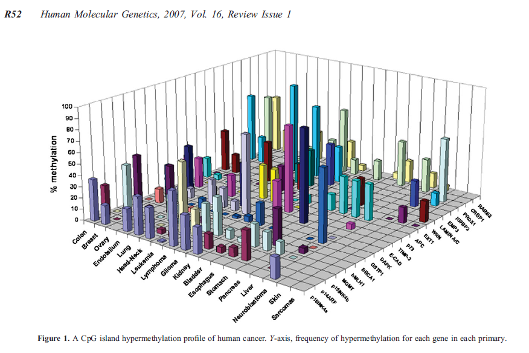
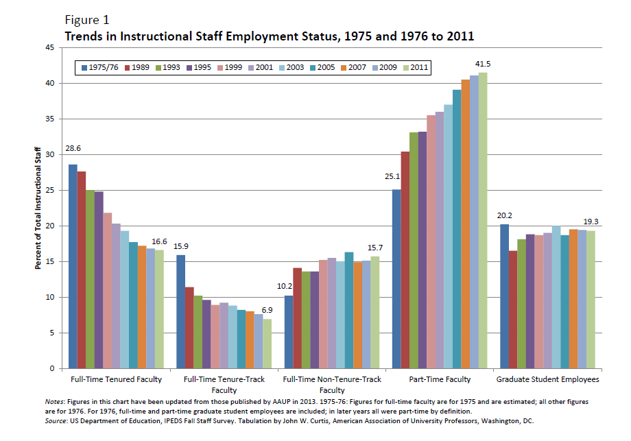

```{r, setup, include=FALSE}
library(tidyverse)
knitr::opts_chunk$set(
  tidy=FALSE,     # display code as typed
  size="small")   # slightly smaller font for code
```

# Good and Bad Visualizations

If you Google `examples of good visualizations` or `bad visualizations` or any combination, you will find a plethora of examples. Understanding the taxonomy can help in identifying poor visualizations and what aspects are poor. It's even better when you can think of appropriate ways to present the material yourself. It is often possible to mention an area of improvement, even if the basic structure of a graphic is sound. 

In this lab, we'll be considering some visualizations to get a sense of what is out there and what to be careful of. As you explore these examples, you'll look for properties you like and issues you see. You'll also be deciding if you think each visualization is good or bad, and you may not agree with your groupmates/peers. 

Note: It is possible to make a bad visualization with ggplot2 (too much information, unreadable, etc.), but it is harder than when free-drawing. Using appropriate software makes it much harder to violate the area principle, for example. 

You'll be critiquing the figures shown at the end of the lab with your groups. First, let's review the Git workflow.

# Git Workflow Review

1. Before editing this file, verify you are working on the copy saved in *your* repo for the course (check the filepath and the project name in the top right corner). 

2. Before editing this file, make an initial commit of the file to your repo to add your copy of the lab. 
3. Change your name at the top of the file and get started! 

4. You should *save, knit, and commit* the .Rmd file each time you've finished a question, if not more often. 

5. You should occasionally *push* the updated version of the .Rmd file back onto GitHub. When you are ready to push, you can click on the Git pane and then click **Push**. You can also do this after each commit in RStudio by clicking **Push** in the top right of the *Commit* pop-up window. 

6. When you think you are done with the lab, save the pdf as "*YourFirstInitialYourLastName*\_*thisfilename*.pdf" before committing and pushing. For example, I would save this file as AWagaman_Lab3a.pdf.


\newpage

Four figures are included at the end of this lab. For each figure, examine the figure individually and then discuss the questions as a group once everyone has had a chance to look it over. You may want to look at the compiled .pdf or the .png files to enlarge the figures compared to how they appear in RStudio. 

## Figure 1 - Genetics

1. What story does the figure tell?
The figure is attempting to show the percentage of methylation one has depending both on what type of cancer you have and what genes you have.

2. As best you can, identify the variables included in the figure, and identify how they're represented (e.g. visual cue).
Cancer type (position on grid), gene type (position on grid), and percentage of methylation (height of bar).

3. What, if anything, do you like about the original figure?
For some combinations of cancers and genes you can clearly see the percent of methylation.

4. What, if anything, were some key problems with the original figure?
One problem is that you can't actually see a lot of the relationships towards the back of the graph. The colors also do not help because the bars are occluding one another and it's hard to identify what row one is looking at.

5. Brainstorm another method of displaying the information in this graph.  Do your best to describe what you would do in an adaptation of the visualization. For example, what would you label your axes and which visual cues would you use? You may suggest breaking the graphic into 2 different plots (still combined to tell the story) if necessary. 
You could use a table where the column is cancer type, row is gene type, and value in the table is percent methylation.

6. In what way(s) is your suggested plot an improvement on the original visualization?
The table is much easier to read, and nothing is being occluded.

7. In what way(s), if any, is the main message of the plot still unclear/hidden even in your adaptation?
You can still see the relationship between cancer type and genes and its effect on the percentage of methylation

8. What is the group consensus about the original plot? Was it a good or bad visualization? (Note, you can brainstorm ways to improve both the good and bad ones!) 
Very bad because it was overly convoluted and too hard to read.

\newpage

## Figure 2 - Napoleon's March

1. What story does the figure tell?
The size of Napoleon's army as he traveled across various locations.

2. As best you can, identify the variables included in the figure, and identify how they're represented (e.g. visual cue).
The size of the army, how far Napoleon had traveled, time,direction, and temperature.

3. What, if anything, do you like about the original figure?
You can visualize the relative loss of size in the army over time pretty well by looking at the graph, and the location of the army is pretty clear.

4. What, if anything, were some key problems with the original figure?
The temperature was plotted backwards, going right to left timewise.


5. Brainstorm another method of displaying the information in this graph.  Do your best to describe what you would do in an adaptation of the visualization. For example, what would you label your axes and which visual cues would you use? You may suggest breaking the graphic into 2 different plots (still combined). 

Another way to display this data would be using a line graph that shows amount traveled on the x axis and troops lost on the y axis, with colored dots added to represent temperature along the journey.

6. In what way(s) is your suggested plot an improvement on the original visualization?

This chart would more clearly/linearly show the drop in troops as time passed. Additionally, the dots showing temperature would more clearly signal the reader to the effect of cold temperature on the loss in troops.

7. In what way(s), if any, is the main message of the plot still unclear/hidden even in your adaptation?

The main message is still clear as the amount of troops would significantly drop as time passes. Additionally, the effect of temperature would still clearly be seen.

8. What is the group consensus about the original plot? Was it a good or bad visualization? (Note, you can brainstorm ways to improve both the good and bad ones!) 

Overall it was still a good visualization because the amount of troops list and time course was easily seen. It probably would be neater using modern graphics but it was not bad for an old visualizastion. =

\newpage

## Figure 3 - AAUP Employment

1. What story does the figure tell?
The figure is attempting to display how the ercent of instructional staff shift across categories at universities over time.

2. As best you can, identify the variables included in the figure, and identify how they're represented (e.g. visual cue).
The variables in the figure are the data, the categories of staff at universities, and the percentage of staff in those categories.

3. What, if anything, do you like about the original figure?
The different categories of staff are clearly seen, and their relative percentages are somewhat easy to compare.


4. What, if anything, were some key problems with the original figure?
The way that the trends over time are documented is very confusing. There are two many colors and it is very hard to get a sense of how these trends are changing over time.

5. Brainstorm another method of displaying the information in this graph.  Do your best to describe what you would do in an adaptation of the visualization. For example, what would you label your axes and which visual cues would you use? You may suggest breaking the graphic into 2 different plots (still combined). 

A better way to track these changes would be to use a scatterplot with time on the x axis and percentage of instructional staff on the y axis, with different colored fitted lines for each category of staff.

6. In what way(s) is your suggested plot an improvement on the original visualization?

This alternative is an improvement because it far more clearly displays the trend over time in the proportion of staff, which is what the graph intended to display.

7. In what way(s), if any, is the main message of the plot still unclear/hidden even in your adaptation?

The main problem with my suggestion is that there are going to be a lot of lines so the plot will be a bit crowded and so it may still be hard to figure out the difference in categories.

8. What is the group consensus about the original plot? Was it a good or bad visualization? (Note, you can brainstorm ways to improve both the good and bad ones!) 

The original plot is a bad visualization in that the trends over time are far too hard to make out.

\newpage

## Figure 4 - British Army Mortality

1. What story does the figure tell?
The figure attempts to show the proportion of the types of morality in the British army over various time periods.

2. As best you can, identify the variables included in the figure, and identify how they're represented (e.g. visual cue).
The variables are the month being examined and the relative proportion of types of death.

3. What, if anything, do you like about the original figure?

It's fairly easy to see the overall trends in total deaths over the various dates being examined.

4. What, if anything, were some key problems with the original figure?

The proportions of each type of death are not very easy to estimate using this pie chart format, and I find them hard to compare across months as well.

5. Brainstorm another method of displaying the information in this graph.  Do your best to describe what you would do in an adaptation of the visualization. For example, what would you label your axes and which visual cues would you use? You may suggest breaking the graphic into 2 different plots (still combined). 

I would use a bar chart where the months are on the x axis and the proportion of deaths are on the y axis, with colors on the bars to represent the types of death.

6. In what way(s) is your suggested plot an improvement on the original visualization?

The relative proportion of each type of death per month would be easier to visualize on a bar chart.

7. In what way(s), if any, is the main message of the plot still unclear/hidden even in your adaptation?

I think in this case the message would be pretty clear in the adaptation.

8. What is the group consensus about the original plot? Was it a good or bad visualization? (Note, you can brainstorm ways to improve both the good and bad ones!) 

This was a fairly good visualization because the time course of deaths over time was pretty clear, even if the categories of death could have been done better.


\newpage

\blandscape



\elandscape

\newpage

\blandscape


\elandscape

\newpage

\blandscape



\elandscape

\newpage

\blandscape


\elandscape


\newpage

## References for Figures

1. Manel Esteller, Epigenetic gene silencing in cancer: the DNA hypermethylome, Human Molecular Genetics, Volume 16, Issue R1, 15 April 2007, Pages R50–R59, https://doi.org/10.1093/hmg/ddm018
2. Charles Minard's map of Napoleon's march. https://en.wikipedia.org/wiki/Charles_Joseph_Minard
3. Curtis, John W. "The employment status of instructional staff members in higher education, Fall 2011." American Association of University Professors (2014): 2011-12.
4. Florence Nightingale's coxcomb graph. https://en.wikipedia.org/wiki/Florence_Nightingale

### Unused but potentially interesting for you

1. Nathan Yau's blog - https://flowingdata.com/
2. Friendly, Michael (2001), Gallery of Data Visualization, Electronic document, http://www.datavis.ca/gallery/
3. Examples of good and bad visuals compiled by CS251 students at Colby College (Prof. Stephanie Taylor) https://cs.colby.edu/courses/S14/cs251/goodbad.php

