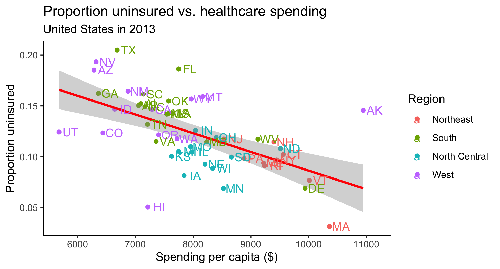

```{r setup, include = FALSE}
# load packages
library(tidyverse)
library(kableExtra)
library(datasets)
library(janitor)

# set code chunk defaults
knitr::opts_chunk$set(tidy = F, # display code as typed
                      size = "small", # slightly smaller code font
                      message = FALSE,
                      warning = FALSE,
                      comment = "\t") 

# set black & white default plot theme
theme_set(theme_classic()) 

# improve digit and NA display 
options(scipen = 1, knitr.kable.NA = '')
```

# Lab Purpose  

The text and our examples covered a lot of different wrangling commands. Previously, you also identified what wrangling commands were doing in provided code. Now, it's your turn to generate the necessary code to do the wrangling and make some neat visualizations. 

A big part of wrangling data is figuring out what your data needs to look like to generate your desired output. You'll need to tackle that step before you can implement the wrangling itself in R. If you get stuck, I suggest sketching out what your data set needs to look like on paper. What are your observations and what variables do you need? It really does help. 

In this lab we will work with the **tidyverse** and **janitor** packages for our wrangling. In addition, the **datasets** package contains a dataset `state` with information on each state such as region that will be useful for us to pull data in from.

You'll work on the lab in the company of classmates to help each other with the challenges of wrangling. 

<!-- Remember to knit and commit as you work through the lab. Then push (along the way and/or) at the end.-->


# Setting - Exploring Health Expenditure using State-level data

This case study is based on an open case study from the OCS project (Kuo et al. 2019).

Health policy in the United States is complicated, and several forms of health care coverage exist. Various mandates exist and there are many different coverage options available. In this lab, our goal is for us to have a general idea about health care economics in the United States. Our focus will be on health care expenditure, including health care coverage and health care spending, across the United States.

Motivating questions:

* Is there a relationship between health care spending and health care coverage by employers in the United States?
* How does the spending distribution change across geographic regions in the United States?
* Does the relationship between health care coverage and health care spending in the United States change from 2013 to 2014?

Data for this lab come from the Henry J Kaiser Family Foundation (KFF).

* [Health Insurance Coverage of the Total Population (2013 -- 2016)](https://www.kff.org/other/state-indicator/total-population/)
     
* [Health Care Expenditures in millions by State of Residence (1991 -- 2014)](https://www.kff.org/other/state-indicator/health-care-expenditures-by-state-of-residence-in-millions/?currentTimeframe=0&sortModel=%7B%22colId%22:%22Location%22,%22sort%22:%22asc%22%7D)

\newpage

# 1 - Understanding the Data

Since our goal is to get a sense of the health expenditure, including health care coverage and health care spending, across states, it would be nice add some information about each state. Namely, the state abbreviation and state region (i.e. north, south, etc). For this we use the various state datasets in the **datasets** R package.  Since the package is already loaded, we can refer directly to any of the state datasets (e.g., `state.abb`) even though we don't them loaded in our environment. However, we can make the `state` datasets appear in our environment by running `data(state)`. 

```{r}
# Load state datasets into environment
data(state) 
```

The state data are split across 7 datasets, all arranged according to alphabetical order of the state names. There are no other variables that can link the datasets together, so we will trust the alphabetical ordering and create our own dataframe from three of the datasets.

```{r}
# Create a data frame with state info
state_info <- data.frame(location = state.name, 
                         abbreviation = state.abb, 
                         region = state.region)
```

> part a - Run the code below to use `read_csv()` to read in the files containing the healthcare coverage and healthcare spending data. Pay attention to the filepath, making modifications if needed based on your own file organization. 

If you copied over the Lab 4b folder in its entirety, the file structure should remain the same. If you pulled individual files over, you may need to adjust. In particular, be sure you pulled the data folder or its files. These files aren't hosted via a web url. 

Solution:

```{r}
coverage <- read_csv("labs/lab4b/data/healthcare_coverage.txt")
spending <- read_csv("labs/lab4b/data/healthcare_spending.txt")
```

<!-- How easy is it to find files in your repo? If you aren't using any folder organization, it's probably a good time to start thinking about that and make some adjustments going forward to how you move files around so that things stay organized. -->

> part b - Now get acquainted with the `coverage` and `spending` datasets.  What years are covered in the `coverage` dataset?  What years are covered in the `spending` dataset? Are there any mismatches between how R specified the variable type and what you expected the type would be?

(Yes, the answers to these questions are above, but how can you confirm this in the datasets?)

Hint: use `glimpse()`.

Solution: Spending covers 1991 to 2014, while coverage covers 2013 to 2016. There are some N/A values in the coverage dataset, where there only should be doubles.

```{r}
glimpse(coverage)
glimpse(spending)
```

> part c - The previous question was intentionally leading---you should have identified some mismatched variable types in the `coverage` dataset. This happened because missing numeric values were recorded as text ("N/A") instead of left empty. Run the code below to fix this problem. Then, in your own words, describe what the various commands (na_if, mutate, across) did. 

```{r}
coverage <- coverage %>% 
  na_if("N/A") %>% 
  mutate(across(.cols = ends_with("Public"), 
                .fns = as.numeric))
```

Solution: na_if finds N/As and replaces them with 'NA' without quotes. Mutate goes over every column ending with public and .cols tells mutate what column to work over, telling them to change the variable type to numeric.


> part d - If we're interested in the relationship between spending and coverage, we'll only be able to use observations that have information on both.  That is, we won't be using data from years for which we only have spending information or only have coverage information. Remove any variables we won't be using from `coverage` and `spending`.

*Hint*: the `starts_with()` function from the **tidyselect** package (already loaded) could help with efficiency here. Also, sometimes "removing" many means "keeping" a few.

Solution:

```{r}
relcoverage <- coverage %>%
  select(Location |starts_with('2013') | starts_with('2014'))
relspending <- spending %>%
  select(Location |starts_with('2013') | starts_with('2014'))
```

> part e - There are 50 states in the United States but 52 observations in the `coverage` and `spending` datasets. The two "bonus" cases contain information about the US as a whole and Washington DC.  Remove these observations from both datasets.

Solution:

```{r}
state_relcoverage <- relcoverage %>%
  filter(Location != "United States" & Location != "District of Columbia")
state_relspending <- relspending %>%
   filter(Location != "United States" & Location != "District of Columbia")
```

<!--
Have you been committing (and pushing)? Now's a good time! "Add answers to Part 1"
-->

\newpage


# 2 - Spending and Coverage Relationship

Is there a relationship between healthcare spending and healthcare coverage by employers in the United States?

We'll want to create a scatterplot with `log(spending)` on the $x$-axis and `log(employer coverage)` on the $y$-axis, with the points colored by year.  (*Why logs?* Both these variables are right-skewed and have large outliers; feel free to check out their histograms and/or look at the un-logged scatterplot if you'd like, as well.)  This is a simple enough scatterplot, but we'll need to do a bit of data tidying before the data are in an appropriate format to create the plot.

> part a - First, sketch what the scatterplot should look like on paper or your tablet or some app (what are the axes? what does each point represent?). What does your dataset need to look like in order to create the scatterplot in `ggplot()`? What will each observation (row) in the dataset represent? What variables (columns) do you need?

Solution: We will need a table with columns for year, location, 


> part b - What are some of the steps that will need to be taken to get the data in that form?

Remember you can reference what the data sets look like currently in multiple ways. 

Solution: 


> part c - Now implement those steps in R, tidying the dataset for plotting.  After the final step, use the `clean_names()` function from the **janitor** package to clean the variable names.

Solution:

```{r}
healthcarejoin <- state_relcoverage %>%
  inner_join(state_relspending, by = "Location")

healthcarestep <- healthcarejoin %>%
  pivot_longer(cols = -Location, 
               name_sep = "__", 
               names_to = c("year", "category"), 
               values_to = "amount")

healthcarewider <- healthcarestep %>%
  pivot_wider(names_from = "category", values_from = "amount") %>%
  clean_names() %>%
  

```


> part d - Now, create the scatterplot! Describe what you see. 

Solution:

```{r}

```

<!--
Whew! You just did a lot. Consider committing and pushing now: 
"Add answers to Part 2"
-->

\newpage

#  3 - Adjusting for population size

We see there is a strong relationship between healthcare spending and coverage within each year. However, we might suspect that health care coverage and spending are each strongly related to population size.  In the `coverage` dataset, the "total" coverage category is not really a formal type of health care coverage; it actually represents the total number of people in the state in that year. This is useful information!  

> part a - Using the dataset you created in Part 2, rename the `total` column to  `total_population` to make the variable name more informative. Then create a scatterplot of employer coverage (y) versus population size (x).

Solution:

```{r}

```


> part b - Now create a second scatterplot of healthcare spending vs. population size. What do you notice?

Solution:

```{r}

```


> part c - To account for total population, create a scatterplot of spending per capita versus proportion with employer coverage.  This time, *color by region* and *facet by year* (think about what additional steps you need to take to make this happen!).

Hint: The total spending column is reported in millions (`1e6`). Therefore, to calculate `spending_per_capita` we will need to adjust for this scaling factor to report it on the original scale (just dollars) and then divide by `total_population`.  

Solution: 

```{r}

```

> part d - Based on your last figure, write a few sentences describing the relationship between health care spending and coverage in the US.

Solution:


<!--
Commit and push! "Add answers to Problem 3"
-->

\newpage


# 4 - State and Region

How does spending vary by state and region?

> part a - Which US state spent the most per capita on health care in 2013? 2014? The least in each year?

Solution:

```{r}

```

> part b - How does the spending distribution change across geographic region in the US?  Create an appropriate figure to visualize the distribution of spending per capita on health care by region. 

Solution:

```{r}

```

> part c - Write a few sentences comparing the distributions.  (Note that you probably will also want to generate summary statistics by region in order to include specific values in your summary paragraph.)

Solution:

```{r}
# Summary Statistics
```

<!--
Commit and push! "Add answers to Problem 4"
-->

\newpage

# 5 - Spending and Proportion of Uninsured Individuals

Does the relationship between healthcare spending and the proportion of uninsured in the United States change from 2013 to 2014?

> part a - Re-create the plot below for 2013.

Hint: use `nudge_x` and/or `nudge_y` in the `geom_text()` layer.

 

Solution:

```{r}

```

> part b - Next, create an analogous plot (separately) for 2014. Does the relationship between health care spending and the proportion of uninsured change from 2013 to 2014?

Solution:

```{r}

```

> part c - Now combine your two plots into one graph, creating one figure that is facetted by year and still colored by region. 

Solution:

```{r}

```

> part d - Lastly, plot the points for both years on the same plot, this time colored by year instead of region.  Make sure you get two lines. 

Solution: 

```{r }

```

> part e - Which of these three visualizations do you find most helpful for comparing the relationship between 2013 and 2014?  Why?

The three visuals are those from parts a and b (together), part c, and part d.

Solution:


<!--
Commit and push! "Add answers to Problem 5". The problem below is not required. 
-->

\newpage

# 6 - Bonus

Done early?  Try to figure out how to make these additional updates to the first figure from the last exercise to hone your plotting skills:

> * remove the "a" on the points in the legend 
> * change the background to be grey
> * make the numbers on the x-axis larger

```{r}

```

You can also try changing fonts for your text, but this is very hard on Windows machines. For Macs, you could visit [this site](http://www.cookbook-r.com/Graphs/Fonts/) to learn more. 

# References 

Kuo, Pei-Lun and Jager, Leah and Taub, Margaret and Hicks, Stephanie. (2019, February 14). opencasestudies/ocs-healthexpenditure: Exploring Health Expenditure using State-level data in the United States (Version v1.0.0). Zenodo. http://doi.org/10.5281/zenodo.2565307


